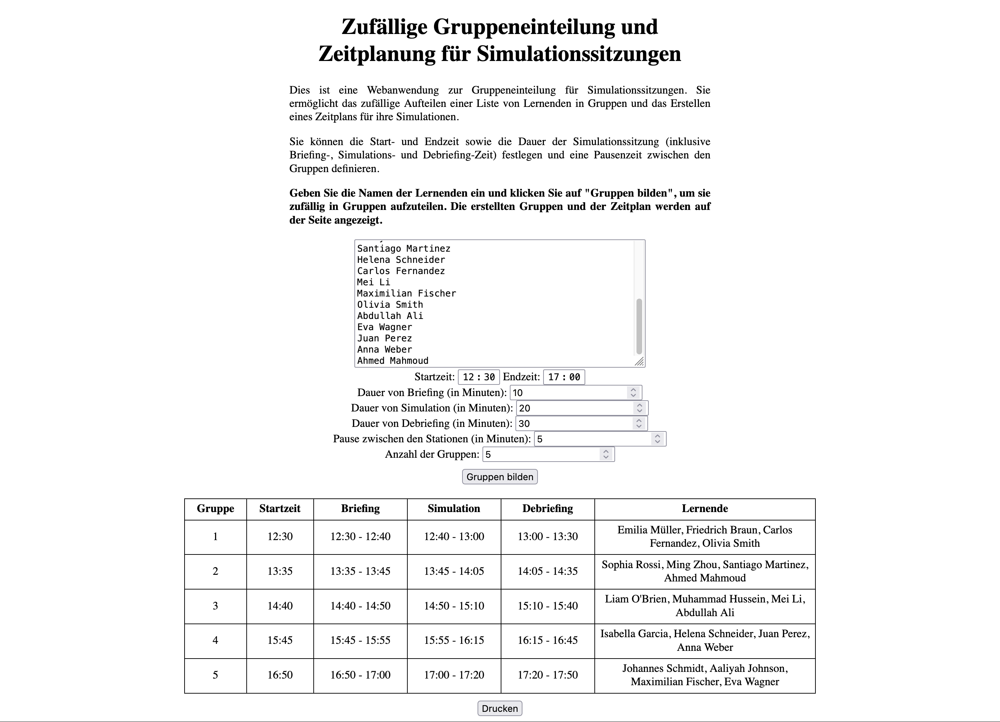
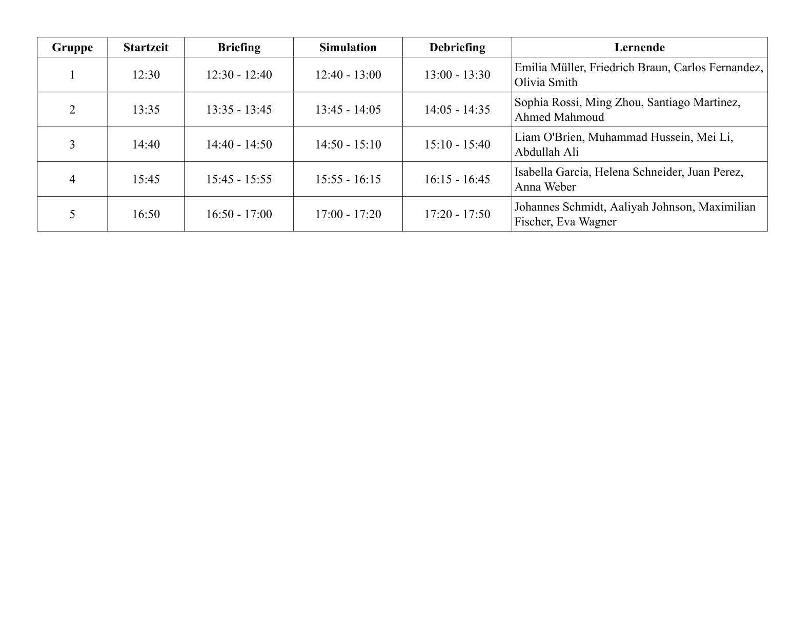

# SimGroup - Zufällige Gruppeneinteilung und Zeitplanung für Simulationssitzungen

Dieses Repository enthält eine Webanwendung zur effizienten Organisation von Gruppen und Zeitplanung für Simulationssitzungen mit Lernenden. 

👉 **[Hier klicken, um die Zeitplanung direkt online auszuprobieren!](https://FlorianLoyns.github.io/SimGroup/)**

## Beschreibung

Die Webanwendung ermöglicht es, eine Liste von Lernenden zufällig in Gruppen aufzuteilen und einen Zeitplan für ihre Simulationssitzungen zu erstellen. Sie können die Start- und Endzeit der Sitzung festlegen sowie die Dauer des Briefings, der Simulation und des Debriefings angeben. Es ist auch möglich, eine Pausenzeit zwischen den Gruppen zu definieren.

## Screenshots

## Verwendung

1. Geben Sie die Namen der Lernenden in das dafür vorgesehene Textfeld ein.
2. Legen Sie die Start- und Endzeit der Simulationssitzung fest.
3. Geben Sie die Dauer des Briefings, der Simulation und des Debriefings in Minuten an.
4. Definieren Sie die Pausenzeit zwischen den Gruppen.
5. Wählen Sie die Anzahl der Gruppen, in die die Lernenden aufgeteilt werden sollen.
6. Klicken Sie auf *Gruppen bilden*, um die Gruppeneinteilung und den Zeitplan zu generieren.
7. Die erstellten Gruppen und der Zeitplan werden auf der Seite angezeigt.
8. Sie können die *Drucken* Schaltfläche verwenden, um die Ergebnisse auszudrucken.

**Hinweis:** Für ein optimales Druckergebnis stellen Sie bitte manuell die Seitenausrichtung auf Querformat ein, da die automatische Seitenausrichtung beim Drucken möglicherweise nicht korrekt funktioniert.

## Anforderungen

Die Webanwendung benötigt einen modernen Webbrowser, der JavaScript unterstützt.
